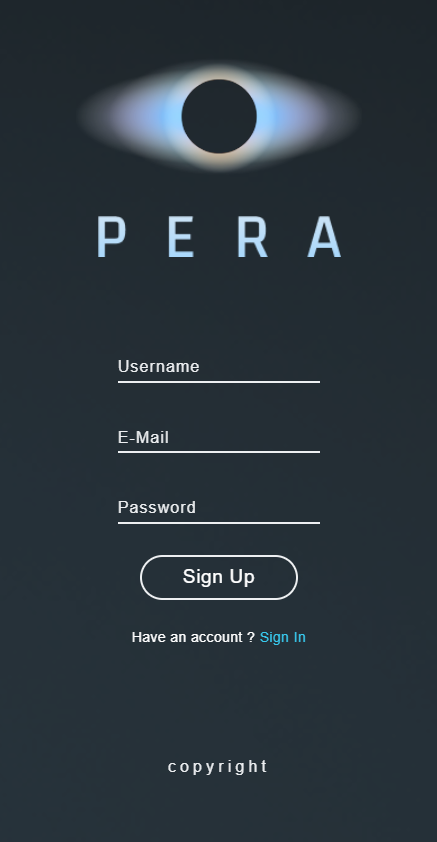
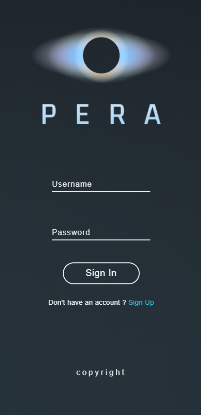

<h1 align="center">🚀 Pera - Space Themed Social Platform</h1>

"Uzayın derinliklerine yolculuk"

---

## 📌 Proje Hakkında

Pera, evrenin büyüsüne kapılmış herkes için hayal edilmiş bir sosyal medya platformu konseptidir. Bu proje, HTML ve CSS ile geliştirilmiş olup; bir mobil uygulama fikrinin basit bir web arayüzü olarak ilk adımıdır.

---

## 🪐 Pera Nedir?

> Pera, evrenin en büyüleyici görsellerini ve bilgilerini paylaşmanızı sağlar.  
> Yıldızlar, gezegenler ve galaksiler arasında serbestçe dolaşarak yeni insanlarla tanışabileceğiniz bir hayal dünyasıdır.

---

## 🖼️ Uygulama Ekranları

### 🔸 Home Screen  

### 🔸 Sign Up  

### 🔸 Sign In  

---

## ✨ Özellikler (Konsept)

- 🗨️ Mesajlaşma
- 🖼️ Fotoğraf paylaşımı
- 🎧 Müzik dinleme
- 🎞️ Kısa video izleme
- 🌌 Uzay temalı sosyal etkileşim

---

## 🛠️ Kullanılan Teknolojiler

- HTML5  
- CSS3  

---

## 📎 Not

Bu proje, HTML ve CSS becerilerimi geliştirmek için oluşturduğum ilk kişisel web arayüzüdür. Gerçek işlevselliği yoktur, konsept arayüz amaçlıdır.

---

## 📫 İletişim

E-posta: **ahmetcnaltintas@gmail.com**  
Web sitem: [ahmetcanaltintas.com](https://ahmetcanaltintas.com)  
LinkedIn: [linkedin.com/in/ahmetcnaltintas](https://linkedin.com/in/ahmetcnaltintas)
